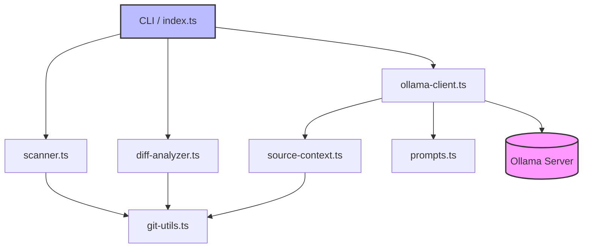

# System Architecture

**Audience:** Engineers, Architects, DevOps  
**Last Updated:** 2026-03-09

## Tech Stack

| Layer | Technology | Version | Purpose |
| :--- | :--- | :--- | :--- |
| **Language** | TypeScript | 5.x | Core logic and type safety |
| **Runtime** | Node.js | LTS | Execution environment |
| **Build Tool** | esbuild | Latest | Bundling and transpilation |
| **Runner** | tsx | Latest | TypeScript execution without build step |
| **LLM Interface** | Ollama | Local | Local LLM inference for documentation generation |
| **Version Control** | Git | Native | Repository state tracking and diff analysis |
| **Configuration** | DEPS.yaml | N/A | Dependency versioning and management |
| **Compiler Config** | tsconfig.json | N/A | TypeScript compilation settings |
| **Package Mgmt** | npm | Native | Dependency installation and scripts |

## Architecture Patterns

*   **CLI Utility Pattern:** The system operates as a command-line tool (`index.ts`), designed for automation and scripting.
*   **Pipeline/Workflow:** Execution follows a linear pipeline: `Scan` → `Analyze` → `Context` → `Generate`.
*   **Client-Server (Local):** The `ollama-client.ts` acts as a client communicating with a local Ollama server instance.
*   **Dependency Injection:** Components (`scanner`, `git-utils`, `ollama-client`) are modular and can be swapped or tested independently.

## System Components

### 1. Orchestrator (`index.ts`)
*   **Responsibility:** Entry point for the application. Manages CLI arguments, initializes dependencies, and coordinates the workflow.
*   **Technology:** TypeScript
*   **Key Interfaces:** `main()`, `run()`, `init()`.

### 2. Scanner (`scanner.ts`)
*   **Responsibility:** Introspects the codebase to identify files, dependencies, and structure.
*   **Technology:** TypeScript, File System API
*   **Key Interfaces:** `scan()`, `getDependencies()`.

### 3. Diff Analyzer (`diff-analyzer.ts`)
*   **Responsibility:** Compares current state against previous commits to determine scope of changes.
*   **Technology:** Git API, TypeScript
*   **Key Interfaces:** `analyzeDiff()`, `getChangedFiles()`.

### 4. Git Utilities (`git-utils.ts`)
*   **Responsibility:** Abstraction layer for Git operations (status, log, diff).
*   **Technology:** Child Process, Git CLI
*   **Key Interfaces:** `gitStatus()`, `gitLog()`.

### 5. Ollama Client (`ollama-client.ts`)
*   **Responsibility:** Communicates with the local Ollama instance to generate documentation content.
*   **Technology:** HTTP Client, JSON
*   **Key Interfaces:** `generate()`, `chat()`.

### 6. Context Provider (`source-context.ts`)
*   **Responsibility:** Aggregates relevant code snippets and metadata to feed into the LLM prompt.
*   **Technology:** TypeScript, File System
*   **Key Interfaces:** `buildContext()`, `extractRelevantCode()`.

### 7. Prompt Manager (`prompts.ts`)
*   **Responsibility:** Defines and manages system/user prompts for the LLM.
*   **Technology:** TypeScript, String Templates
*   **Key Interfaces:** `getSystemPrompt()`, `getUserPrompt()`.

## Component Relationships

## Data Flow

1.  **Input:** User triggers CLI command pointing to a target repository.
2.  **Scanning:** `scanner.ts` identifies project structure and dependencies.
3.  **Diff Analysis:** `diff-analyzer.ts` queries `git-utils.ts` to determine changed files since last commit.
4.  **Context Assembly:** `source-context.ts` extracts relevant code from changed files.
5.  **Prompt Construction:** `prompts.ts` combines context with system instructions.
6.  **Generation:** `ollama-client.ts` sends prompt to local Ollama instance.
7.  **Output:** LLM response is parsed and written to `docs/` directory.

## Infrastructure

*   **Hosting:** Local execution or CI/CD pipeline (GitHub Actions, GitLab CI).
*   **LLM Runtime:** Local Ollama server (Docker or native binary).
*   **Storage:** Local file system for source code and generated documentation.
*   **Network:** Localhost (127.0.0.1) for Ollama communication.
*   **Dependencies:** Managed via `docgen/package.json` and `DEPS.yaml`.

## Design Decisions

| Decision | Rationale | Trade-off |
| :--- | :--- | :--- |
| **Local LLM (Ollama)** | Ensures data privacy (code not sent to external APIs) and offline capability. | Requires local compute resources and model management. |
| **TypeScript Monorepo** | Type safety across `docgen` logic and shared utilities. | Slightly higher build complexity compared to JS. |
| **Modular Components** | Allows individual components (e.g., `scanner`) to be tested or replaced. | Increased file count and initial setup overhead. |
| **Git-based Diffing** | Precise tracking of changes ensures documentation stays in sync with code. | Requires Git repository to be initialized and clean. |
| **ESBuild / tsx** | Fast build times and development iteration compared to Webpack. | Less mature ecosystem for complex bundling scenarios. |