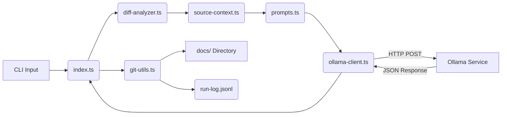

# docgen-template — System Architecture

**Last Updated:** 2026-03-09

## 1. Audience
This document is intended for:
- **Software Engineers**: Understanding component boundaries and data flow.
- **System Architects**: Evaluating trade-offs and scalability.
- **DevOps Engineers**: Managing infrastructure and deployment pipelines.

## 2. Tech Stack

| Layer | Technology | Version | Purpose |
| :--- | :--- | :--- | :--- |
| **Runtime** | Node.js | 20.x | Server-side execution environment |
| **Language** | TypeScript | 5.x | Type-safe development |
| **LLM Runtime** | Ollama | 0.1.x | Local LLM inference engine |
| **Build Tool** | TypeScript Compiler | 5.x | Compilation and type checking |
| **Package Manager** | npm | 10.x | Dependency management |
| **Documentation** | Markdown | N/A | Static documentation generation |
| **Version Control** | Git | 2.x | Source control and diff analysis |

## 3. Architecture Patterns

The system follows a **CLI-Driven Static Generation** pattern with a **Pipeline Architecture**:

- **Pipeline Pattern**: The `docgen` module acts as a pipeline where data flows through sequential stages:
  1. **Ingestion**: Git diff analysis (`diff-analyzer.ts`).
  2. **Context Construction**: Source context aggregation (`source-context.ts`).
  3. **Generation**: LLM-based content creation (`ollama-client.ts`).
  4. **Output**: File system writes (`git-utils.ts`).
- **CLI Interface**: The application is invoked via command line, reading from stdin or arguments and writing to stdout/files.
- **Stateless Execution**: Each run is an isolated process; state is managed via the `run-log.jsonl` and file system persistence.

## 4. System Components

### 4.1 `docgen/index.ts` (Orchestrator)
- **Responsibility**: Entry point, argument parsing, and orchestration of the generation pipeline.
- **Technology**: TypeScript
- **Key Interfaces**:
  - `run(args: string[]): Promise<void>`
  - `init(): Promise<void>`

### 4.2 `docgen/diff-analyzer.ts` (Input Processor)
- **Responsibility**: Parses `git diff` output to identify changed files and lines.
- **Technology**: TypeScript, Regex/AST parsing
- **Key Interfaces**:
  - `analyzeDiff(diffOutput: string): ChangeSet`
  - `getChangedFiles(): string[]`

### 4.3 `docgen/source-context.ts` (Context Builder)
- **Responsibility**: Aggregates relevant source files, configuration, and existing documentation to build the prompt context.
- **Technology**: TypeScript, File System API
- **Key Interfaces**:
  - `buildContext(changes: ChangeSet): ContextObject`
  - `readFile(path: string): string`

### 4.4 `docgen/ollama-client.ts` (LLM Interface)
- **Responsibility**: Communicates with the local Ollama instance to generate documentation content based on the prompt.
- **Technology**: TypeScript, HTTP Client (Fetch)
- **Key Interfaces**:
  - `generate(prompt: string, options: OllamaOptions): Promise<string>`
  - `streamResponse(prompt: string): AsyncIterable<string>`

### 4.5 `docgen/git-utils.ts` (Output Handler)
- **Responsibility**: Writes generated content to the `docs/` directory and updates the run log.
- **Technology**: TypeScript, File System API
- **Key Interfaces**:
  - `writeDoc(path: string, content: string): Promise<void>`
  - `logRun(runId: string, status: string): Promise<void>`

### 4.6 `docgen/prompts.ts` (Prompt Engineering)
- **Responsibility**: Defines and manages system/user prompts for the LLM.
- **Technology**: TypeScript (Template Literals)
- **Key Interfaces**:
  - `getSystemPrompt(): string`
  - `getUserPrompt(context: ContextObject): string`

## 5. Component Relationships

The components interact in a linear flow with the Ollama client acting as an external dependency.

- **Orchestrator (`index.ts`)**: Coordinates the flow, calling the analyzer, context builder, and output handler.
- **Ollama Client**: Acts as a bridge to the external inference engine. It handles HTTP requests and response parsing.
- **Git Utils**: Handles side effects (file I/O) to ensure generated content is persisted.

## 6. Data Flow

1. **Trigger**: User executes the `docgen` script.
2. **Diff Analysis**: `diff-analyzer.ts` captures the current state of the repository, identifying modified files.
3. **Context Assembly**: `source-context.ts` reads the current state of relevant files (e.g., `DEPS.yaml`, `CLAUDE.md`, existing docs) and combines them with the diff data.
4. **Prompt Construction**: `prompts.ts` formats the context into a structured prompt tailored for the specific document type (e.g., Architecture, README).
5. **Inference**: `ollama-client.ts` sends the prompt to the Ollama API.
   - *Configuration*: `num_predict` is set to 8192 to ensure complete generation.
   - *Thinking Mode*: Disabled to optimize for speed and determinism.
6. **Generation**: The LLM returns the generated Markdown content.
7. **Persistence**: `git-utils.ts` writes the content to the appropriate file in `docs/` and logs the run status to `docgen/.run-log.jsonl`.

## 7. Infrastructure

- **Hosting**: Local execution environment. The tool is designed to run on developer workstations or CI runners.
- **LLM Inference**: Local Ollama instance (Docker container or native binary).
- **Storage**:
  - **Source**: Git Repository (`.git` directory).
  - **Output**: Local file system (`docs/` directory).
  - **Logs**: Local JSONL file (`docgen/.run-log.jsonl`).
- **Dependencies**:
  - No external cloud dependencies (AWS, Azure, etc.) required for core functionality.
  - Network access required only for local Ollama API (localhost:11434).

## 8. Design Decisions

| Decision | Rationale | Trade-off |
| :--- | :--- | :--- |
| **Local Ollama Inference** | Ensures data privacy (code never leaves the machine) and reduces latency compared to remote APIs. | Requires local hardware resources (RAM/GPU) and setup complexity for Ollama. |
| **High `num_predict` (8192)** | Documentation generation can be verbose; increasing the limit prevents truncation of long architectural descriptions. | Increased inference time and token usage per request. |
| **Disabled Thinking Mode** | Optimizes for deterministic output and faster generation times for repetitive documentation tasks. | May reduce the "reasoning" depth of the LLM for complex architectural queries. |
| **JSONL Logging** | Provides a structured, append-only log of all generation runs for auditability and debugging. | Requires manual parsing for historical analysis; not a real-time dashboard. |
| **TypeScript Pipeline** | Ensures type safety for file paths and API responses, reducing runtime errors during generation. | Slightly higher build time compared to pure JavaScript scripts. |